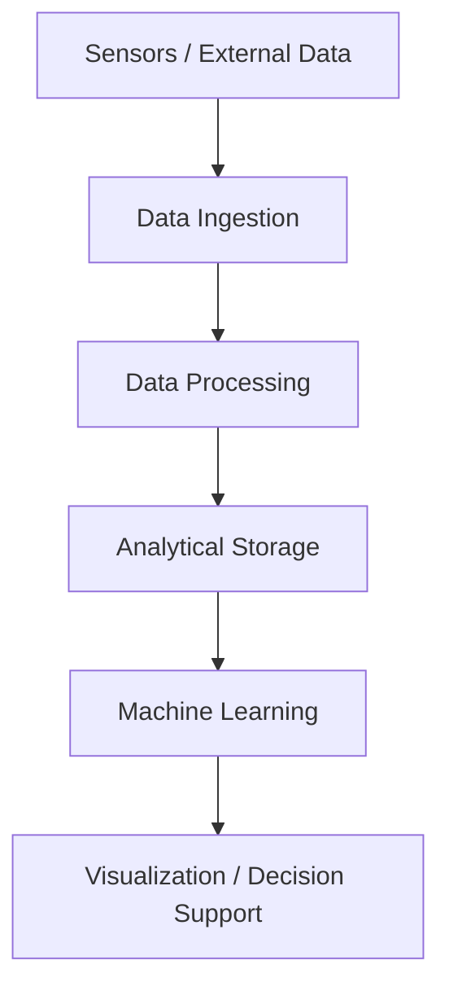

# Daniel Wonyifraw 👋

🧠 Data Engineering • 🤖 Machine Learning • 🏗️ Software Architecture

I design and build **data-intensive software systems** that operate in real environments — messy data, real-time constraints, reliability requirements, and long-term maintainability.

🎓 **Engineering Doctorate (EngD) in Data Science**  
JADS / Eindhoven University of Technology

My work sits at the intersection of **data engineering, machine learning, and software architecture**, with a focus on systems that remain understandable and maintainable long after the demo phase.

---

# What I Build

I help organizations design and implement **reliable data platforms and intelligent systems**.

### Data Engineering
- real-time data pipelines  
- streaming architectures  
- ETL and data integration  
- scalable data platforms

### Machine Learning Systems
- model deployment and monitoring  
- time-series forecasting  
- applied ML for operational systems

### Software Architecture
- distributed systems design  
- cloud-based data platforms  
- maintainable data system architectures

---
# Urban Digital Twin data pipline 


A central project of my work is the design and development of an **Urban Digital Twin platform** for the City of ’s-Hertogenbosch.

The system integrates:

- real-time streaming pipelines  
- geospatial and spatiotemporal data processing  
- time-series analytics  
- forecasting and machine-learning models  
- interactive visualization for urban exploration and decision support

The platform is designed as a **living system** that evolves with real data rather than a static simulation model.

---

# Data Engineering System Architecture

```text
Sensors / External Data Sources
            │
            ▼
     Data Ingestion Layer
   (Streaming APIs / Kafka)
            │
            ▼
     Data Processing Layer
      (ETL / Stream Jobs)
            │
            ▼
    Analytical Storage Layer
   (Time-Series / Data Lake)
            │
            ▼
 Machine Learning & Forecasting
            │
            ▼
Visualization & Decision Support
```


---

# Engineering Principles

I prefer systems that are:

- **Composable** — replaceable parts, minimal lock-in  
- **Explicit** — clear interfaces and data contracts  
- **Inspectable** — debuggable without folklore  
- **Maintainable** — designed for the second year, not the second week  

Complexity should be visible, not hidden.

---

# Open Source

I am an open-source practitioner primarily within the **Python ecosystem**, focusing on data infrastructure, reproducibility, and clarity of implementation.

---

# Collaboration

Through **DataTwinLabs**, I collaborate with public organizations and industry partners on:

- urban data platforms  
- digital twin systems  
- real-time analytics pipelines  
- applied AI systems

---

# Links

🌐 Website  
https://datatwinlabs.nl  

💼 LinkedIn  
https://www.linkedin.com/in/danielwondyifraw/  

📄 Publications / Talks  
https://www.jads.nl/news/paving-the-way-for-sustainable-urban-construction/  

📫 Contact  
datatengineerd@outlook.com
